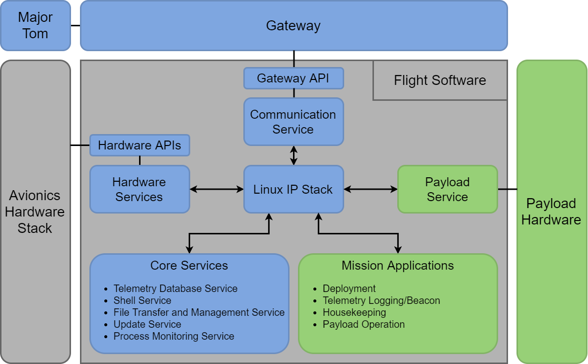

KubOS Architecture Overview
===========================

The KubOS system is designed to take care of every aspect of the satellite flight software. From the board up, it has every component you need to complete a mission. 

The KubOS Stack
---------------

.. figure:: images/architecture_stack.png
    :align: center

OBC (On Board Computer)
~~~~~~~~~~~~~~~~~~~~~~~

Starting from the bottom, the OBC is up to you, as long as it is in our supported list. The current list of supported OBCs can be found :doc:`here <index.rst>`. We are also continually working to support new platforms, so make sure you talk to us if your OBC is not included! 

Kubos Linux
~~~~~~~~~~~

Kubos Linux is Kubos's Linux build (pretty self explanatory). If you want more information on how it works, what's included, etc, Check it out :doc:`here <os-docs/index.rst>`. 

Kubos APIs
~~~~~~~~~~

There are several Kubos APIs for accomplishing a variety of tasks within Kubos Linux, but the main definition is that they are all statically linked libraries. Anything that behaves this way is considered an API, regardless of what hardware is it interacting with. For example, there are APIs for UART and I2C communication, as well as interaction with specific hardware such as the ISIS iMTQ. You can get more information about what APIs are available and what they do :doc:`here <apis/index.rst>`. 

Kubos Services
~~~~~~~~~~~~~~

The last Kubos portion of the stack is the Kubos Services. These are defined as any persistent process that is used to interact with the satellite. Services rarely make decisions, but will allow the user to accomplish typical Flight Software tasks such as telemetry storage, file management, shell access, hardware interaction, etc. More information about the scope of services can be found :doc:`here <services/index.rst>`. 

Mission Applications
~~~~~~~~~~~~~~~~~~~~

The final portion of the KubOS system is the Mission Applications. These applications are anything that governs the behavior of the satellite. Some common examples are deployment, housekeeping, and telemetry beaconing. Basically anything that you want the satellite to do autonomously goes into this category. More information on and examples of Mission Applications can be found :doc:`here <applications/index.rst>`. 

Typical Mission Architecture
----------------------------

Below is a diagram of a typical mission using KubOS. 

In the above diagram, everything in blue is typically Kubos-developed, while everything in green would be mission code and written by the user for their specific mission and payload. 

Kubos is continually integrating new hardware