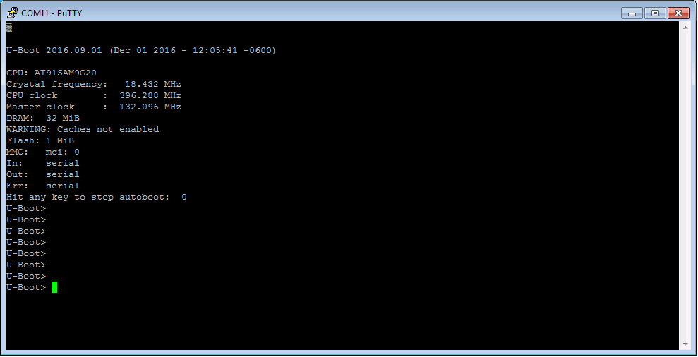
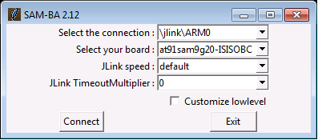
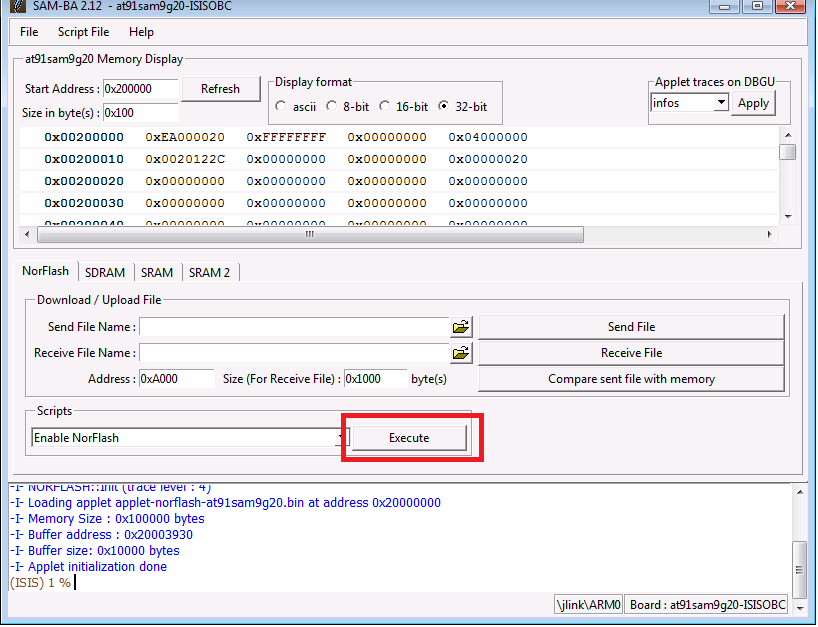
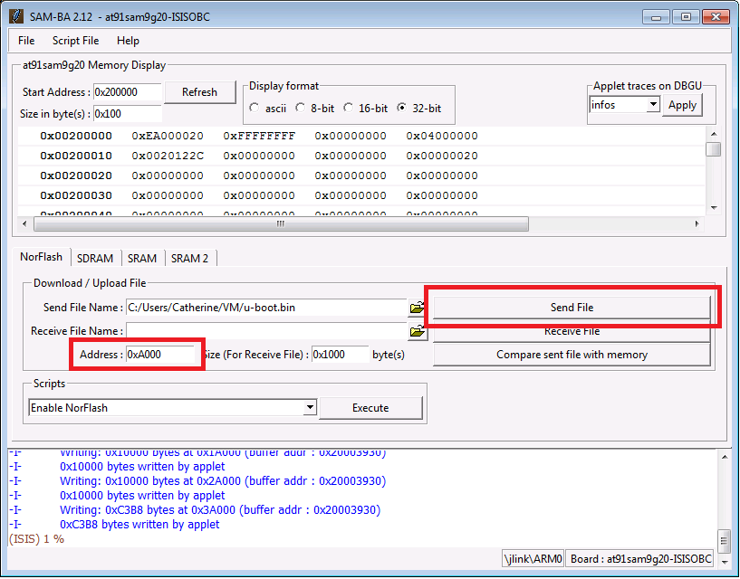
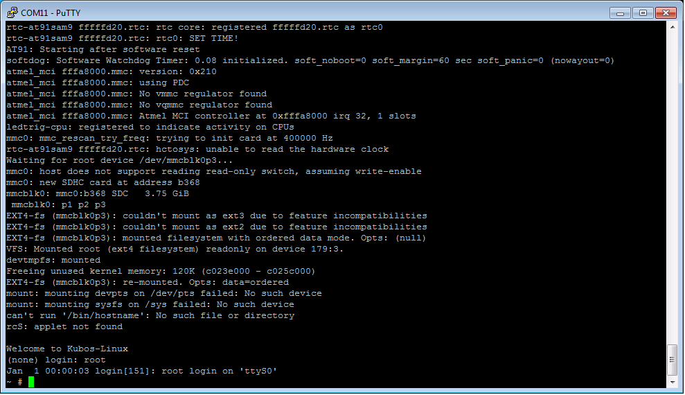

#KubOS Linux on the ISIS iOBC

[Overview](#overview)

[Software Components](#software-components)

[Installation Process](#installation-process)

##Overview

The goal of this document is to create a KubOS Linux installation for the iOBC that can then run the satellite services (telemetry, payload communication, etc) 
needed for the ISIS customers' missions.

The [User Applications on the ISIS iOBC](docs/user-app-on-iobc.md) doc can then be used to create and load a user application on top of the new KubOS Linux install.

**Note:** Ideally, the user should never have to mess with the kernel themselves.  It should be pre-loaded onto the iOBC.

##Software Components

###ISIS Bootloader

The ISIS bootloader lives in the very beginning of the NOR flash. It should come pre-loaded on the board and should not need to be modified. It 
initializes the memory hardware and then copies U-Boot into the SDRAM and starts its execution.

###U-Boot

[Wiki](https://en.wikipedia.org/wiki/Das_U-Boot)

[Site Page](http://www.denx.de/wiki/U-Boot)

U-Boot, at the most basic level, is responsible for loading the kernel from the SD card into the SDRAM. However, it also provides a basic OS and CLI
which can be used to configure and debug the kernel before it's loaded.

###Kernel

####Linux

We're using Linux 4.4. This is the current long-term support version (LTS) and will be supported until early 2018.

####uClibc

[Overview](https://uclibc.org/about.html)

uClibc is the smaller version of the GNU C library that has been built with embedded Linux systems in mind.

####BusyBox

[Overview](https://busybox.net/about.html)

BusyBox provides many of the common Linux console and shell commands, but in a smaller package.

###BuildRoot

The current development tool for building all of the components required for running embedded Linux.

###SAM-BA

The software tool used to flash the kernel and components onto the iOBC.

##Installation Process

###Build the OS Files

Create new folder

    $ mkdir kubos-linux

Enter the new folder

    $ cd kubos-linux
  
Download BuildRoot-2016.11 (more current versions of BuildRoot may work as well, but all testing has been done against 2016.11)

    $ wget https://buildroot.uclibc.org/downloads/buildroot-2016.11.tar.gz && tar xvzf buildroot-2016.11.tar.gz && rm buildroot-2016.11.tar.gz
  
Pull the kubos-linux-build repo

    $ git clone http://github.com/kubostech/kubos-linux-build
  
Move into the buildroot directory

    $ cd buildroot-2016.11
  
Point BuildRoot to the external kubos-linux-build folder and tell it to build the iOBC

    $ make BR2_EXTERNAL=../kubos-linux-build at91sam9g20isis_defconfig
  
Build everything

    $ make
  
The full build process will take a while.  Running on a Linux VM, it took about an hour.  Running in native Linux, it took about
ten minutes.  Once this build process has completed once, you can run other BuildRoot commands to rebuild only certain sections
and it will go much more quickly (<5 min).

BuildRoot documentation can be found [**here**](https://buildroot.org/docs.html)

The generated files will be located in buildroot-2016.11/output/images.  They are:

- uboot.bin   - The U-Boot binary
- zImage      - The compressed Linux kernel file
- {board}.dtb - The Device Tree Binary that Linux uses to configure itself for your board
- rootfs.tar  - The root file system.  Contains BusyBox and other libraries

###Install the SD Card Files

Due to their size, the zImage and rootfs files live on the SD card.

To start, find the name of your SD card in your system:

    $ sudo fdisk -l
    
You should see a device that looks like this:

    Disk /dev/sdb: 3.8 GiB, 4025483264 bytes, 7862272 sectors
    Units: sectors of 1 * 512 = 512 bytes
    Sector size (logical/physical): 512 bytes / 512 bytes
    I/O size (minimum/optimal): 512 bytes / 512 bytes
    Disklabel type: dos
    Disk identifier: 0xf39e6ab1
    
In this example '/dev/sdb' is the name of the SD card.  You might also see '/dev/mmcblk0'.  You'll need to use this name in all future commands.

####Partition the SD Card

First, you'll need to set up the partitions on the SD card:

Create a partition table

    $ sudo parted {name} mklabel msdos y
    
Create the partitions 

    $ sudo parted {name} mkpart primary linux-swap 1M 513M
    $ sudo parted {name} mkpart primary fat16 513M 534M
    $ sudo parted {name} mkpart primary ext4 534M 4000M
    
Configure the partitions (ex. /dev/sdb1) 

    $ sudo mkswap {name}{partition1}
    $ sudo mkfs.fat {name}{partition2}
    $ sudo mkfs.ext4 {name}{partition3}

####Copy the files

Next, you'll need to copy the zImage file into the boot partition and the rootfs into the rootfs partition

From your project folder:

Create mount folders

    $ mkdir boot
    $ mkdir rootfs
    
Mount the partitions

    $ sudo mount {name}{partition2} boot
    $ sudo mount {name}{partition3} rootfs
    
Copy the zImage file into partition 2

    $ sudo cp buildroot-2016.11/output/images/zImage boot
    
Untar the rootfs into partition 3

    $ sudo tar -xvf buildroot-2016.11/output/images/rootfs.tar -C rootfs
    
Unmount the partitions

    $ sudo umount {name}{partition2}
    $ sudo umount {name}{partition3}
    
Remove the SD card and insert it into iOBC SD card slot 0

###Install the NOR Flash Files

####Pre-Requisites

1. Obtain a SEGGER SAM-ICE programmer/debugger
2. Install programming drivers from [https://www.segger.com/jlink-software.html](https://www.segger.com/jlink-software.html)
3. Install FTDI USB-to-serial drivers from [http://www.ftdichip.com/Drivers/VCP.htm](http://www.ftdichip.com/Drivers/VCP.htm)
4. Install SAM-BA (and PuTTY, if you don't already have it) from the ISIS-OBC SDK installer. (Refer to Section 3.3 of the ISIS-OBC Quick Start Guide)
4. Setup the iOBC board for serial connection and programming. (Refer to Chapter 4 of the ISIS-OBC Quick Start Guide)
5. Connect the programming and serial connection cables to your computer.
6. Power the board.

Note:  Make sure the red jumper on the programming board is in place; it bypasses the watchdog.  If you don't, the board will
continually reboot and you won't be able to flash anything.

####Boot into U-Boot (Optional)

(Skip this section if you've never put Linux on your board before)

If you already have Linux running on your board, you'll need to boot into the U-Boot console rather than the Linux console in order to be able to
flash the board.

You'll need to establish a serial connection with the board in order to connect to the console.  Set up a serial connection to the board at a 
baudrate of 115200.

--- 
 
 ---s

Once the serial connection is open, boot (or reboot) the board.  Hold down any key while the board is starting up.  This will exit out of the 
auto-boot and bring up the CLI.

--- 
 
 ---s

####Flash the Files

Start up SAM-BA.  You'll want to select the at91sam9g20-ISISOBC option from the 'Select your board' drop-down.

--- 
 
 ---s

Execute the 'Enable NorFlash' script.  This will prep the board to enable flashing.

--- 
 
 ---s

Select the uboot.bin file in the 'Send File Name' field.

Make sure that 'Address' is set to 0xA000.

Click 'Send File'

--- 
 
 ---s

Select the at91sam9g20isis.dtb file in the 'Send File Name' field (you'll need to view all file types in order to see the .dtb file)

Set 'Address' to 0x60000.

Click 'Send File'

--- 
 
 ---s

###Boot the System

You should now be able to set up a serial connection to your board and boot it into Linux.

You'll need to establish a serial connection with the board in order to connect to the console.  Set up a serial connection to the board at a 
baudrate of 115200.

--- 
 
 ---s

You should see the console boot into Linux like this:

--- 
 
 ---s
