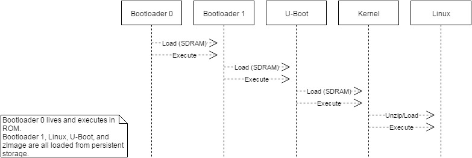

# KubOS Linux Overview

##Introduction

This is intended as a higher-level overview of the KubOS Linux configuration, installation, and distribution for the Kubos clients' embedded systems.

The high level components of every system will be:
- Low-level bootloader/s
- U-Boot (mid-level bootloader. Loads KubOS Linux)
- KubOS Linux

Ideally, all the files will be delivered to the customer as a pre-baked OBC. They'll just need to upload their user app files onto the board.

Boot-up UML diagram:

Boot-up with storage flow:

## OS Installation

### Bootloader #0

Each OBC should have an initial bootloader preloaded in ROM. Its job is to load the next bootloader from wherever it's living into SDRAM to execute.
We shouldn't have to interact directly with this much.

### Bootloader #1

This will be **highly non-portable**. The customer will either need to provide one, or we'll need to create a custom bootloader for each board that
we come across. The main purpose of this bootloader is to load U-Boot from wherever it is located in storage (NOR|NAND|DataFlash|SD @ address) into
some location in SDRAM (probably by default, the very beginning of SDRAM)

### U-Boot

[Wiki](https://en.wikipedia.org/wiki/Das_U-Boot)

[Site Page](http://www.denx.de/wiki/U-Boot)

U-Boot, at the most basic level, is responsible for loading the kernel (zImage) from persistent storage into the SDRAM. However, it also provides a 
basic OS and CLI which can be used to configure and debug the kernel before it's loaded.

### KubOS Linux Kernel

The kernel can be built to support many boards at a time.  It is usually only constrained by high-level hardware things like CPU architecture (ex. ARM).
Some systems may need non-standard kernel because of size or other constraints.

The kernel is actually composed of multiple components: the main linux kernel, the libc library, and the command/utility library.

Mostly we should be able to create and distribute one main kernel that all the boards can use.

Using BuildRoot allows us to include tools like BusyBox and glibc with the kernel and rootfs at build time.

#### zImage

The zImage file is unpacked from the kernel file (which contains headers for checksum validation) and then loaded into SDRAM by U-Boot and contains a compressed version of the Linux kernel. The first few hundred bytes of the file are not compressed and are responsible for uncompressing the rest of the kernel and then kicking off the main kernel execution.

#### Linux

[Linux 4.4 Overview](https://kernelnewbies.org/Linux_4.4)

We're using Linux 4.4.  This is the current long-term support version (LTS) and will be supported until early 2018.

#### Glibc

[Overview](https://www.gnu.org/software/libc/)

We use the standard GNU C library to build our toolchains. We are currently building using v2.23.

#### BusyBox

[Overview](https://busybox.net/about.html)

We're currently using v1.25.0.

BusyBox provides many of the common Linux console and shell commands, but in a smaller package.  If there are any commands or tools that need to be
added, they will likely be added through the busybox configuration.

Currently enabled BusyBox commands:

    [, [[, addgroup, adduser, awk, cat, catv, chgrp, chmod, chown,
    chpasswd, chroot, cksum, clear, cp, cut, date, deallocvt, delgroup,
    deluser, df, dirname, du, dumpkmap, echo, egrep, env, expr, false,
    fgrep, find, fold, fsync, getty, grep, gzip, halt, hush, id, ifconfig,
    ifdown, ifup, init, inotifyd, ionice, iostat, ip, ipaddr, iplink,
    iproute, iprule, iptunnel, kill, killall, killall5, linuxrc, ln,
    loadkmap, login, logname, ls, lzcat, lzma, man, mkdir, mknod, mkpasswd,
    modinfo, more, mount, mv, nice, passwd, ping, pkill, poweroff,
    printenv, printf, ps, pwd, readlink, realpath, reboot, renice, reset,
    resize, rm, rmdir, sed, seq, setserial, sh, sha256sum, sha512sum,
    sleep, sort, split, start-stop-daemon, stat, stty, sync, tail, tar,
    tee, test, time, timeout, top, touch, tr, true, truncate, umount,
    uname, uncompress, unlink, unlzma, unshare, unzip, uptime, usleep, vi,
    watch, watchdog, wc, which, whoami, yes

### Device Tree Binary

[Site Page](https://www.devicetree.org/)

[Free Electrons Tutorial](https://events.linuxfoundation.org/sites/events/files/slides/petazzoni-device-tree-dummies.pdf)

This is the memory and capability mapping file that tells Linux what features/peripherals are available on the board and what memory location they're located at.  The human-readable files are \*.dts and \*.dtsi (.dts-"include") and are converted into one device tree binary file (\*.dtb) at build time. 

This is a highly specific file for each board and has similar cases to U-Boot.  If we're lucky, a dtb file will already exist for the exact board that we want.  Most likely, there will be dts\* files for the CPU, but not the exact board, so we'll have to modify a file that is close to what we want.
If we're unlucky, we'll have to write the dts\* files from scratch, which will be painful and take a while.

Unfortunately, there isn't one great tutorial for writing and updating device tree files.  It's very much trial-and-error.  I recommend looking at the files for boards with similar processors and peripherals to see examples for the various component definitions.

Note:  There is also an option to bake the data from the \*.dtb file directly into the zImage file.  However, this capability is largely implemented as a support option for older boards and isn't something that we should need to use. 
