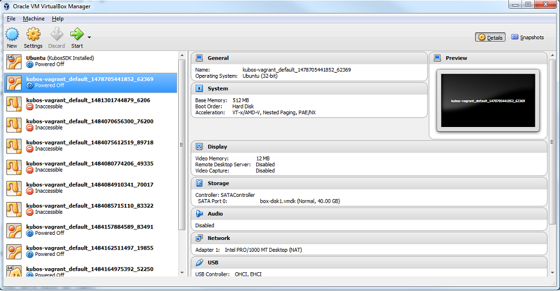
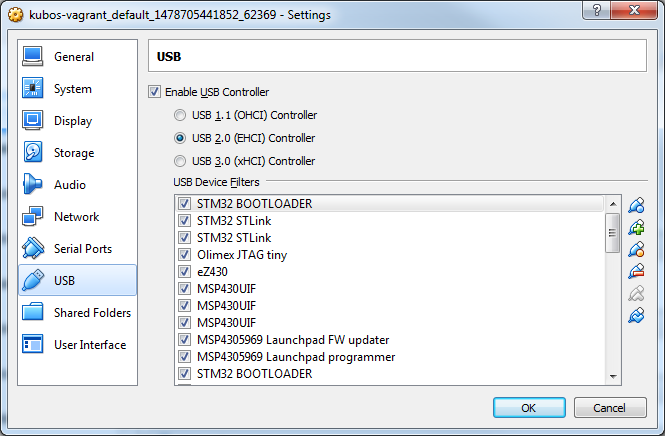
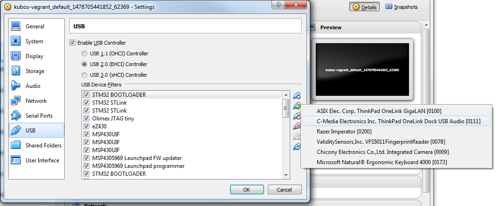

# Working with the ISIS IOBC

[TOC]

# Working with the ISIS IOBC {#working-with-the-isis-iobc}

This document is intended as an introductory guide for creating, loading, and using Kubos projects and other files within the user space of KubOS Linux on the ISIS iOBC.

## Reference Documents {#reference-documents}

### iOBC Documentation

The *ISIS-OBC Quickstart Guide* should have been packaged with the iOBC and is a useful document for learning what each of the hardware components are, how to 
connect them, and what drivers need to be installed to support them.

### Kubos Documentation

- [Installing the Kubos SDK](docs/sdk-installing.md) - Basics of setting up the Kubos SDK environment
- [Creating your first project](docs/first-project.md) - Steps to create and build a Kubos SDK project (Note: Written for a KubOS RT end-target)
- [SDK Command Reference](docs/sdk-reference.md) - Overview of the common Kubos SDK commands
- [KubOS Linux Overview](docs/kubos-linux-overview.md) - Overview of the KubOS Linux components
- [KubOS Linux on iOBC](docs/kubos-linux-on-iobc.md) - Steps to build and load KubOS Linux for the iOBC

## Building a Project {#building-a-project}

In order to build a project for the ISIS-OBC, you'll need to create a Kubos SDK project for KubOS Linux, set the correct target, and then build it.

    $ kubos init -l newproj
    $ kubos target kubos-linux-isis-gcc
    $ kubos build
    
## Updating Credentials {#updating-credentials}

Ideally, you should not be using the default root user password.  If you've changed it, you'll need to pass the new password to the Kubos flash utility
through the config.json file, which should be located in the top-level directory of your project.  You'll need to create the file if it doesn't already
exist.  Update the system.password parameter with the password to use.

If you're creating a brand new config.json file, you can just copy and paste the text below (*newpass* should be your desired password):

    {
        "system" : {
            "password" : "newpass"
        }
    }

## Setting Initialization Configuration {#init-config}

There are several config.json options available which customize how and when a user application is started:

* system.initAfterFlash - (Default: false) Tells the Kubos SDK whether to start the application as a background daemon after flashing it to the board.
* system.initAtBoot - (Default: true) Tells the Kubos SDK whether to generate and install an initialization script.
* system.runLevel - (Default: 50. Range: 10-99) Sets priority of initialization script.

When the `system.initAfterFlash` option is turned on, the user application will be started as a background daemon at the end of the `kubos flash` process. This is done using Linux's `start-stop-daemon` command. By default this feature is turned off, so the value of the option will need to be set to "true" by the user in order to turn it on.

By default, an initialization script will be generated and installed during the flashing process. This script will follow the naming convention of "S{runLevel}{applicationName}", where "runLevel" is the initialization priority order of the script. All user application init scripts will be run after all of the Kubos init scripts, but within the user scripts, the scripts with the lowest run level will be executed first. So an application with a run level of 10 will be initialized before an application with a run level of 50.

To turn this feature off, set the `system.initAfterBoot` option to "false".

The run level of an initialization script can be changed after initially flashing the script to the board. Simply change the `system.runLevel` value, rebuild the project, and then reflash it to the board. The old script will be removed as part of the flash process.
    
## Updating the USB Connection {#updating-the-usb-connection}

The iOBC should be shipped with an FTDI cable.  This cable should be connected to the programming adapter, which should then be connected to the iOBC, to create the debug UART connection.  User file transfer will take place using this connection.

The Kubos flashing utility was configured with the assumption that an FTDI cable would be used.  If you have a different USB-to-serial cable type, you'll need to pass through the USB connection, and then update the minicom configuration to tell the flashing utility which USB to flash over.

You can either pass through the USB via VirtualBox or by updating the vagrant's Vagrantfile.

**Note:** While it doesn't need to be passed through, a SAM-ICE JTAG might also need to be connected to both the iOBC and the host computer in order to create a successful connection.

### VirtualBox

Open the VirtualBox Manager

Right-click on your vagrant VM and select Settings.  Click the USB tab.

Click the USB icon with the plus symbol to add a new USB filter.  Select the device you want to add and press OK.

### Updating the Vagrantfile

Navigate to you vagrant installation directory on your host machine.

Open the Vagrantfile.

You should see a section labeled 'usb_devs'.  You want to add a new entry for your USB device to the bottom of this list.

The format is

    ['vendor_id', 'product_id', 'Description']
    
The description can be whatever you want, but the vendor and product IDs will need to be found from the connection on your host computer.

Once you've updated Vagrantfile, issue the command `vagrant reload` to cause the VM to pick up the new definition.  Once you've logged in to the VM, you 
should be able to see the passed-through connection with the `lsusb` command.

#### On Windows

1. Go to the "Start" Menu.
2. Select "Devices and Printers"
3. Double-click your USB Scale.
4. Select the "Hardware" Tab.
5. Select "Properties"
6. Select the "Details" Tab.
7. From the "Device description" Menu select "Hardware Ids"
8. Copy the numbers next to "VID_" and "PID_"

#### On Mac

Issue the `system_profiler SPUSBDataType` command.  

Copy the values in the values in the 'Product ID' and 'Vendor ID' fields

#### On Linux

Issue the `lsusb` command.

Copy the values in the 'ID' field.  The value in front of the colon should be the vendor ID and the value after should be the product ID.

###Updating the minicom configuration

Navigate to /etc/minicom, you should see a file call minirc.kubos.  This is the preset minicom serial connection configuration file for KubOS Linux.

Edit the file and update the 'pu baudrate' field and change '/dev/FTDI' to the '/dev/*' device name your USB connection has.

* You can find this device by issuing `ls /dev/`.  The connection will likely be one of the /dev/ttyUSB* devices.

You can test the changes by issuing the `minicom kubos` command.  If you successfully connect to your board, then the changes have been successful.

## Flashing the Board {#flashing-the-board}

The USB-to-serial cable and SAM-ICE JTAG should be connected to the iOBC and the board should be fully powered.

Assuming you've successfully built a Kubos SDK project for the ISIS-OBC board, when you issue the `kubos flash` the output should look like this:

    info: found newproj at source/newproj
    Compatible FTDI device found
    Sending file to board...
    Bytes Sent: 693248/1769379 BPS:8343 ETA 02:08
    Transfer Successful
    Execution time: 21 seconds
    
    
### Non-Application Files {#non-app-files}

Non-application files (such as custom scripts) can be also be flashed onto a KubOS Linux system. They will be loaded into the '/home/usr/local/bin' directory by the `kubos flash` command. After the command has completed, the files can be manually moved to a preferred directory using the standard Linux `cp` or `mv` commands.

In order to flash a non-application file, add the full path of the file to the end of the `kubos flash` command. 

**Note:** The file does not need to reside within a Kubos SDK project, but the `kubos flash` command must still be run from the project, since that is where the target configuration information is stored.

For example:

    $ kubos flash /home/vagrant/not-my-project/test-util.sh

## Flash Troubleshooting {#flash-troubleshooting}

Flashing a file to the board can fail for various reasons. Sometimes simply reattempting the command can correct the problem.

If retrying doesn't work, here is a list of some of the error you might see after running the `kubos flash` command and the recovery actions you can take:

"No compatible FTDI device found"

- Check that the iOBC is turned on and connected to your computer
- Check that no other vagrant images are running.  Only one VM can have control of the USB, so it may be that another instance
currently has control of the device.  You can shutdown a vagrant image with the command `vagrant halt`
- Verify that the USB is showing up within the vagrant environment with the `lsusb` command.  You should see an FTDI device
- Verify that the USB has been mapped to a linux device.  Issue the command `ls /dev`.  You should see a /dev/ttyUSB* device. 
If you don't, try rebooting your vagrant image (`vagrant halt`, `vagrant up`)
    
"Transfer Failed: Connection Failed"

- The SDK was unable to connect to the iOBC
- Verify that the USB has been mapped to a linux device.  Issue the command `ls /dev`.  You should see a /dev/ttyUSB* device. 
If you don't, try rebooting your vagrant image (`vagrant halt`, `vagrant up`)
- If this error occurs after the transfer process has started, then the SDK likely lost connection to the iOBC.  Verify that
the board is still correctly connected and powered and try the flash command again.

"Transfer Failed: Invalid Password"

- The SDK was unable to log into the iOBC.  Verify that the password is correctly defined in your config.json file by issuing
the `kubos config` command.
    
System appears to have hung

- If for some reason file transfer fails, it can take a couple minutes for the connection to time out and return control.
- If you've waited a couple minutes and the system still appears hung, please let us know so that we can open a bug report.

## Debug Console {#debug-console}

If the iOBC is correctly connected to your host computer, you should see a /dev/ttyUSB* device in your vagrant VM.  The VM is set up to automatically forward any
FTDI cables that connect to a /dev/FTDI device for ease-of-use.

The vagrant image comes pre-packaged with a minicom serial connection configuration file for the iOBC debug uart port.  You can connect with this configuration file
using the command

    $ minicom kubos
    
Alternatively, you can manually create a serial connection with minicom (or other terminal application) using the following connection configuration:

| Setting   | Value  |
|-----------|--------|
| Baudrate  | 115200 |
| Bits      | 8      |
| Parity    | N      |
| Stop Bits | 1      |

Once connected, you can log in using either a user that you've created, or root, which has a default password of 'Kubos123'.

Fully logged in, the console should look like this:

    Welcome to KubOS Linux
    
    (none) login: root
    Password: 
    Jan  1 00:00:16 login[212]: root login on 'ttyS0'
    ~ # 

## Manual File Transfer {#manual-file-transfer}

If for some reason you want to manually transfer a specific file onto the iOBC, for example a custom script, you'll need to do the following:

Connect to the board through minicom (the file transfer protocol is not guaranteed to work with any other terminal program)

    $ minicom kubos
    
Login to the board

    Welcome to minicom 2.7
    
    OPTIONS: I18n
    Compiled on Feb  7 2016, 13:37:27.
    Port /dev/FTDI, 21:26:43
    
    Press CTRL-A Z for help on special keys
    
    
    Welcome to KubOS Linux
    (none) login: root
    Password:
    Jan  1 00:00:11 login[210]: root login on 'ttyS0'
    ~ #

Navigate to the location you'd like the received file to go.

    ~ # mkdir righthere
    ~ # cd righthere
    ~/righthere #

Issue the zModem command to prep the board to receive a file

    $ rz -bZ
    
Press **Ctrl+a**, then press **s** to open the minicom file transfer dialog.

    +-[Upload]--+
    | zmodem    |
    | ymodem    |
    | xmodem    |
    | kermit    |
    | ascii     |
    +-----------+

Select zmodem

    +-------------------[Select one or more files for upload]-------------------+
    |Directory: /home/vagrant                                                   |
    | [..]                                                                      |
    | [linux]                                                                   |
    | [newprj]                                                                  |
    | minicom.log                                                               |
    |                                                                           |
    |              ( Escape to exit, Space to tag )                             |
    +---------------------------------------------------------------------------+
    
                   [Goto]  [Prev]  [Show]   [Tag]  [Untag] [Okay]

Select the file to send:

Press `g` to open the Goto dialog and navigate to the desired folder (full pathname required).

Press enter to open the file selector dialog and specify the file you want within the current folder.

    +-------------------[Select one or more files for upload]-------------------+
    |Directory: /home/vagrant/linux/build/kubos-linux-isis-gcc/source           |
    | [..]                                                                      |
    | [CMakeFiles]                                                              |
    | CMakeLists.txt                                                            |
    | CTestTestfile.cmake                                                       |
    | cmake_install.cmake                                                       |
    | linux                                                                     |
    | linux.map                                                                 |
    |                +-----------------------------------------+                |
    |                |No file selected - enter filename:       |                |
    |                |> linux                                  |                |
    |                +-----------------------------------------+                |
    |                                                                           |
    |              ( Escape to exit, Space to tag )                             |
    +---------------------------------------------------------------------------+
    
                   [Goto]  [Prev]  [Show]   [Tag]  [Untag] [Okay]

You should see a progress dialog as your file is transferred to the board.

    +-----------[zmodem upload - Press CTRL-C to quit]------------+
    |^XB00000000000000rz waiting to receive.Sending: linux        |
    |Bytes Sent:  41984/  99084   BPS:8905     ETA 00:06          |
    |                                                             |
    |                                                             |
    |                                                             |
    |                                                             |
    |                                                             |
    +-------------------------------------------------------------+
    
Once file transfer is complete, you should be able to press enter and use your new file

    +-----------[zmodem upload - Press CTRL-C to quit]------------+
    |^XB00000000000000rz waiting to receive.Sending: linux        |
    |Bytes Sent:  99084   BPS:7982                                |
    |                                                             |
    |Transfer complete                                            |
    |                                                             |
    | READY: press any key to continue...                         |
    |                                                             |
    +-------------------------------------------------------------+
    
Press **Ctrl+a**, then **q** to bring up the dialog to exit minicom.  Hit enter to quit without reset.

## Example Program {#walkthrough}

Let's walk through the steps to create the example KubOS Linux project.

Initialize the project

    $ kubos init --linux newproj
    
Move into the project folder

    $ cd newproj
    
Set the project target

    $ kubos target kubos-linux-isis-gcc
    
Build the project

    $ kubos build
    
Flash the project

    $ kubos flash
    
Log into the board

    $ minicom kubos
    Login: root/Kubos123

Run the example application

    $ newproj
    
Output should look like this:

    Initializing CSP
    Starting example tasks
    Ping result 80 [ms]
    Packet received on MY_PORT: Hello World
    Ping result 90 [ms]
    Packet received on MY_PORT: Hello World
    Ping result -1 [ms]
    Packet received on MY_PORT: Hello World
    Ping result 60 [ms]
    Packet received on MY_PORT: Hello World
    Ping result 50 [ms]
    Packet received on MY_PORT: Hello World
    
Press **Ctrl+C** to exit execution.

Press **Ctrl+A**, then **Q** to exit minicom.

## User Accounts {#user-accounts}

In general, it is preferred to use a non-root user account to interact with a Linux system. A default user account 'kubos' is included with KubOS Linux. Other user accounts can be created using the standard Linux commands (`adduser`, `useradd`, etc).

All user accounts should have a home directory in the format '/home/{username}'.

## KubOS Linux File System {#file-system}

There are a few key directories residing within the KubOS Linux user space.

#### /home

All user-created files should reside under the /home directory. This directory maps to a separate partition from the root file system. As a result, all files here will remain unchanged if the system goes through a kernel upgrade or downgrade.

The home directories of all user accounts, except root, should live under this directory. 

***
**Any files not residing under the /home directory will be destroyed during an upgrade/downgrade**
***

#### /home/usr/bin

All user-created applications will be loaded into this folder during the `kubos flash` process. The directory is included in the system's PATH, so applications can then be called directly from anywhere, without needing to know the full file path.

#### /home/usr/local/bin

All user-created non-application files will be loaded into this folder during the `kubos flash` process. There is currently not a way to set a destination folder for the `kubos flash` command, so if a different endpoint directory is desired, the files will need to be manually moved.

#### /home/etc/init.d

All user-application initialization scripts live under this directory. The naming format is 'S{run-level}{application}'.

